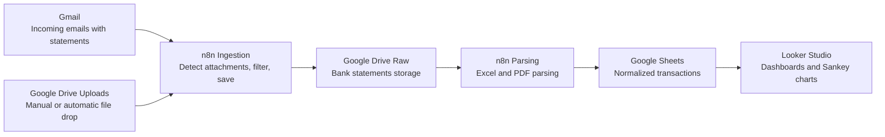

<!--
Sync Impact Report - Constitution v1.0.0
============================================

Version Change: Initial creation → v1.0.0
Rationale: First formal constitution establishing ETL-first governance for FinFlow

Modified Principles: N/A (initial creation)
Added Sections:
  - Core Principles (7 principles specific to ETL and finance automation)
  - Architecture Definition
  - Development Workflow
  - Governance

Templates Status:
  ✅ plan-template.md - Reviewed, compatible with ETL focus
  ✅ spec-template.md - Reviewed, user story format aligns with data pipeline features
  ✅ tasks-template.md - Reviewed, phase structure supports workflow-based development
  ⚠ Future work: Consider adding ETL-specific task categories (ingestion, parsing, normalization, visualization)

Follow-up TODOs:
  - Establish baseline n8n workflow versioning scheme
  - Define data quality metrics for normalization pipeline
  - Create runbook for credential rotation procedures
-->

# FinFlow Constitution

## Core Principles

### I. Data Pipeline Integrity (NON-NEGOTIABLE)

Every ETL stage MUST maintain data lineage and be independently verifiable. This means:

- **Ingestion** MUST preserve original files unchanged in raw storage
- **Parsing** MUST log transformation errors without blocking the pipeline
- **Normalization** MUST be idempotent (re-running produces identical results)
- **Failed transactions** MUST be quarantined with error context, never silently dropped
- All pipeline stages MUST emit structured logs with correlation IDs

**Rationale**: Financial data requires audit trails. Lost or corrupted transactions erode trust and violate personal finance accuracy requirements. Idempotency enables safe retries.

### II. Workflow-as-Code

All n8n workflows MUST be version-controlled as JSON exports in `/n8n/workflows/`. This requires:

- Meaningful workflow names following pattern: `[stage]-[source]-[action].json` (e.g., `ingestion-gmail-detect-statements.json`)
- Workflows MUST NOT contain hardcoded credentials (use n8n credential references)
- Breaking changes to workflow contracts (input/output schemas) require MAJOR version bump
- Each workflow export MUST include a companion README documenting triggers, expected inputs, error handling

**Rationale**: n8n's GUI-based editor risks configuration drift. Version control enables rollback, diff review, and disaster recovery. Credential separation prevents secret leakage.

### III. Schema-First Normalization

The Google Sheets data model is the canonical schema. All parsers MUST conform to it:

- **Required columns** (defined in `/misc/docs/etl/normalized-schema.md`): Date, Merchant, Amount, Currency, Category, Account, TransactionID
- Parsers MUST map bank-specific formats to this schema
- Schema changes require migration plan and version increment
- Unknown/unmappable fields MUST be stored in a JSON `RawMetadata` column for future analysis

**Rationale**: Multiple banks produce different formats. A single canonical schema enables cross-bank analytics, consistent dashboard queries, and easier parser maintenance.

### IV. Modular Parsing

Each bank/statement format MUST have an isolated parser module:

- Parsers live in `/scripts/parsers/[bank-name]/`
- Each parser MUST expose a standard interface: `parse(file_path) → transactions[]`
- Parsers MUST include sample input files (anonymized) in `/scripts/parsers/[bank-name]/samples/`
- Parser tests MUST verify: schema compliance, edge cases (missing fields, invalid dates), error handling

**Rationale**: Banks change export formats unpredictably. Modular parsers isolate failure impact and simplify testing. Sample files enable regression testing without production data.

### V. Fail-Fast Ingestion, Resilient Processing

Ingestion (Gmail/Drive triggers) MUST fail fast on invalid inputs. Parsing/normalization MUST be resilient:

- **Ingestion validation**: File type check (Excel/PDF only), size limits, attachment count
- Invalid files MUST be moved to quarantine folder with alert notification
- **Parsing resilience**: Parser failures MUST NOT crash the workflow; log error + move file to error folder
- **Retry logic**: Transient failures (API rate limits, network) MUST retry with exponential backoff (max 3 attempts)

**Rationale**: Early validation prevents junk data from polluting pipelines. Resilient parsing ensures one bad file doesn't block all transactions. Retries handle temporary infrastructure issues.

### VI. Dashboard-Driven Development

All ETL changes MUST consider dashboard impact:

- New data fields MUST document Looker Studio usage intent
- Breaking schema changes MUST include dashboard migration plan
- Sankey chart logic (money flow categorization) MUST be testable outside Looker Studio (e.g., test script generating expected flows)
- Dashboard access MUST be documented in `/misc/docs/setup/looker-studio-setup.md`

**Rationale**: The dashboard is the user-facing output. ETL exists to serve visualization needs. Untestable dashboard logic creates debugging black holes.

### VII. Secure Credentials, Observable Failures

All external integrations MUST use secure credential management and produce observable errors:

- **Credentials**: Gmail, Drive, Sheets APIs MUST use OAuth2 via n8n credential store (never hardcoded tokens)
- Credential rotation MUST be documented in `/misc/docs/setup/credential-rotation.md`
- **Error observability**: Failed API calls MUST log: service name, error code, retry attempt, correlation ID
- Critical failures (e.g., unable to write to Sheets after retries) MUST send alert (email/Slack webhook)

**Rationale**: Personal finance data is sensitive. Leaked credentials enable unauthorized access. Observable failures enable rapid incident response.

## Architecture Definition

FinFlow implements a six-stage ETL pipeline for personal finance automation:



**Stage Definitions**:

1. **Sources (Gmail, Drive)**: Automated and manual file ingestion channels
1. **Ingestion (n8n)**: Trigger-based detection, validation, raw file persistence
1. **Raw Storage (Drive)**: Immutable archive of original statements
1. **Parsing (n8n + scripts)**: Format-specific conversion to JSON
1. **Normalized Storage (Sheets)**: Canonical schema for all transactions
1. **Visualization (Looker Studio)**: Interactive dashboards, Sankey flow charts

**Repository Structure**:

```
finflow/
├── misc/
│   └── docs/
│       ├── architecture/           # System design, data flow diagrams
│       ├── copilot/                # GitHub Copilot implementation guides
│       │   ├── step-1-create-constitution-file.md
│       │   ├── step-2-setup-repository-structure.md
│       │   ├── step-3-implement-ingestion-workflows.md
│       │   ├── step-4-build-parser-modules.md
│       │   ├── step-5-configure-normalization.md
│       │   ├── step-6-create-looker-dashboards.md
│       │   └── prompt-library.md
│       ├── etl/                    # Stage-specific documentation
│       │   ├── ingestion.md
│       │   ├── parsing.md
│       │   ├── normalization.md
│       │   └── normalized-schema.md
│       └── setup/                  # Installation, credentials, deployment
│           ├── n8n-setup.md
│           ├── credential-rotation.md
│           └── looker-studio-setup.md
├── n8n/
│   ├── workflows/              # Version-controlled n8n exports
│   │   ├── ingestion-gmail-detect-statements.json
│   │   ├── ingestion-drive-monitor-uploads.json
│   │   ├── parsing-excel-to-sheets.json
│   │   └── parsing-pdf-to-sheets.json
│   └── data/                   # n8n runtime data (gitignored)
├── scripts/
│   ├── parsers/                # Bank-specific parser modules
│   │   ├── bank-a/
│   │   │   ├── parser.py
│   │   │   ├── samples/
│   │   │   └── README.md
│   │   └── bank-b/
│   └── utils/                  # Shared helpers (date parsing, validation)
├── config/
│   ├── banks.json              # Bank metadata (name, formats, parsers)
│   └── categories.json         # Transaction category definitions
└── README.md
```

## Development Workflow

### 1. Contribution Process

All changes follow this workflow:

1. **Feature Specification** (`/specs/[###-feature]/spec.md`): Define user stories with acceptance criteria
1. **Implementation Plan** (`/specs/[###-feature]/plan.md`): Technical design, affected components, testing strategy
1. **Constitution Check**: Verify compliance with all principles before implementation
1. **Test Creation**: Write failing tests for new parsers, normalization rules, or workflow logic
1. **Implementation**: Build the feature
1. **Validation**: Tests pass, manual end-to-end verification via dashboard
1. **Documentation**: Update affected docs (parser READMEs, schema docs, setup guides)
1. **Review**: Code review verifies principle compliance + test coverage

### 2. Naming Conventions

- **n8n Workflows**: `[stage]-[source]-[action].json` (lowercase, hyphens)
- **Parser Modules**: `/scripts/parsers/[bank-slug]/parser.py` (bank-slug = lowercase, hyphens)
- **Feature Branches**: `###-feature-name` (issue number + kebab-case)
- **Documentation Files**: `kebab-case.md`
- **Configuration Files**: `kebab-case.json` or `.env`

### 3. Versioning Strategy

**n8n Workflows**:

- Use semantic versioning in workflow descriptions: `v[MAJOR].[MINOR].[PATCH]`
- **MAJOR**: Breaking change to input/output schema or trigger contract
- **MINOR**: New functionality (e.g., additional error handling, new data fields)
- **PATCH**: Bug fixes, performance improvements, refactoring

**Parsers**:

- Version documented in parser module docstring
- **MAJOR**: Breaking schema change (output no longer matches normalized schema)
- **MINOR**: Support for new statement format variant
- **PATCH**: Bug fixes in field mapping logic

**Normalized Schema** (`normalized-schema.md`):

- Version tracked in document header
- **MAJOR**: Column removal or rename
- **MINOR**: New required column
- **PATCH**: Documentation clarifications, new optional column

### 4. Testing Standards

**Parser Testing** (MANDATORY for new parsers):

- Unit tests MUST validate: sample file parsing, schema compliance, error handling (malformed dates, missing amounts)
- Test files MUST use anonymized data (no real account numbers, names, or amounts)
- Coverage target: 90%+ for parser logic

**Workflow Testing** (RECOMMENDED):

- End-to-end tests: Drop sample file in Drive → verify normalized row appears in Sheets
- Manual testing checklist documented in `/misc/docs/etl/testing-checklist.md`

**Dashboard Testing** (MANUAL):

- After schema changes, verify: Sankey chart renders, filters work, date ranges accurate
- Screenshot expected vs. actual dashboard state for regression validation

### 5. Error Handling Standards

All workflows MUST implement:

1. **Error Nodes**: n8n error handling nodes configured for each parser/API call
1. **Quarantine**: Failed files moved to `Drive/FinFlow/Quarantine/[YYYY-MM-DD]/`
1. **Alerts**: Critical failures trigger notification (document recipient in `/misc/docs/setup/alerts.md`)
1. **Logging**: Use n8n's logging nodes with structured JSON: `{timestamp, stage, error, correlationId, file}`

### 6. Documentation Requirements

When adding/changing:

- **New parser**: Update `/scripts/parsers/[bank]/README.md` with: supported formats, sample output, known limitations
- **Schema change**: Update `/misc/docs/etl/normalized-schema.md` + migration guide
- **Workflow change**: Update workflow's companion README with new trigger logic or error handling
- **Dashboard field**: Document purpose in `/misc/docs/etl/normalized-schema.md` under field description
- **Copilot workflow**: Document AI-assisted development patterns in `/misc/docs/copilot/` for reusability

## Development with GitHub Copilot

GitHub Copilot is the primary AI assistant for FinFlow development. All contributors SHOULD leverage Copilot following these patterns:

### 1. Feature Development Workflow with Copilot

**Step 1: Specification Creation**

- Use Copilot Chat to draft feature spec from user requirements
- Prompt: "Create a feature spec for [requirement] following /misc/.specify/templates/spec-template.md. Include user stories with priorities and acceptance criteria."
- Review and refine: Copilot generates initial structure; you add domain-specific details

**Step 2: Implementation Planning**

- Ask Copilot to analyze constitutional compliance
- Prompt: "Review this spec against /.specify/memory/constitution.md. Check for violations of the 7 core principles."
- Generate implementation plan: "Create implementation plan following plan-template.md. Focus on ETL stages affected: [ingestion/parsing/normalization]."

**Step 3: Parser Development**

- Provide sample data to Copilot (anonymized)
- Prompt: "Create a parser for [BankName] that converts this Excel format to our normalized schema in /misc/docs/etl/normalized-schema.md. Follow modular parsing principle (Principle IV)."
- Copilot generates: parser.py, tests, README
- Verify: Schema compliance, error handling, sample file coverage

**Step 4: n8n Workflow Design**

- Use Copilot to design workflow logic (not the JSON export)
- Prompt: "Design error handling logic for n8n workflow that processes [bank] statements. Must quarantine failures and retry with exponential backoff per Principle V."
- Copilot provides: pseudocode, error scenarios, logging structure
- Manually implement in n8n GUI, then export to `/n8n/workflows/`

**Step 5: Test Generation**

- Always generate tests BEFORE implementation
- Prompt: "Write pytest tests for [parser/function]. Test cases: valid input, missing required fields, invalid date formats, malformed amounts. Target 90% coverage."
- Run tests → verify they FAIL → implement feature → tests PASS

**Step 6: Documentation Updates**

- Auto-generate documentation updates
- Prompt: "Update /misc/docs/etl/normalized-schema.md to document the new [FieldName] column. Include: purpose, data type, Looker Studio usage, migration notes."

### 2. Copilot Prompt Library

Store reusable prompts in `/misc/docs/copilot/prompt-examples.md`:

**Constitution Check**:

```
Review [feature-spec.md] against /.specify/memory/constitution.md.
For each of the 7 core principles, verify compliance.
Flag violations with severity (CRITICAL/WARNING) and suggest mitigation.
```

**Parser Scaffolding**:

```
Create Python parser module for [BankName] at /scripts/parsers/[bank-slug]/:
- Input: Excel file with columns [list columns]
- Output: List of dicts matching /misc/docs/etl/normalized-schema.md
- Include: Error handling, date parsing with multiple formats, amount validation
- Generate: parser.py, test_parser.py, README.md, samples/ folder
```

**Schema Migration Plan**:

```
Generate migration plan for schema change: adding [NewColumn] to normalized schema.
Include:
1. Impact analysis (workflows, parsers, dashboards affected)
2. Backward compatibility strategy
3. Looker Studio dashboard updates required
4. Rollback procedure
```

**n8n Error Handling Design**:

```
Design error handling for n8n workflow [workflow-name]:
- Stage: [ingestion/parsing/normalization]
- Error scenarios: [list scenarios]
- Requirements: Quarantine to Drive, structured logging, alert on 3rd retry failure
- Output: Error node configurations, folder structure, log schema
```

### 3. Testing with Copilot

**Test-Driven Development Pattern**:

1. Copilot generates failing tests from acceptance criteria
1. Prompt: "Convert user story acceptance criteria from spec.md into pytest tests. Tests must FAIL initially."
1. Review test quality: edge cases, schema validation, error paths
1. Implement feature until tests pass
1. Copilot assists with refactoring while keeping tests green

**Test Data Generation**:

- Prompt: "Generate 10 anonymized bank transaction rows for testing [BankName] parser. Include edge cases: missing merchant, negative amounts, future dates, non-USD currency."
- Copilot creates realistic test fixtures without real PII

### 4. Code Review with Copilot

Before submitting PR, use Copilot for self-review:

**Constitution Compliance**:

```
Review this [parser/workflow/script] against constitution principles:
- Data Pipeline Integrity: Check idempotency, error quarantine, logging
- Schema-First: Verify output matches normalized-schema.md
- Secure Credentials: Flag any hardcoded tokens or secrets
```

**Security Audit**:

```
Audit this code for security issues:
- Credential exposure in logs or error messages
- SQL injection risks (if applicable)
- File path traversal vulnerabilities
- PII leakage in test files or examples
```

### 5. Onboarding New Contributors

New developers use Copilot-guided onboarding:

1. **Understanding the System**:

   - Prompt: "Explain the FinFlow ETL pipeline using /misc/docs/architecture/ and README.md. What are the 6 stages and their responsibilities?"

1. **Constitution Learning**:

   - Prompt: "Summarize the 7 core principles from /.specify/memory/constitution.md. For each, explain WHY it exists (the rationale)."

1. **First Task Walkthrough**:

   - Prompt: "I'm adding a parser for [NewBank]. Walk me through the contribution process from /.specify/memory/constitution.md. Generate the feature spec outline."

### 6. Documentation Maintenance

**Quarterly Documentation Review**:

- Prompt: "Audit /misc/docs/ for outdated information. Check: workflow versions match /n8n/workflows/, schema docs match Google Sheets reality, setup guides reference current n8n version."

**Auto-Generate Runbooks**:

- Prompt: "Create incident response runbook for scenario: [parsing workflow fails for all banks]. Include: diagnosis steps, rollback procedure, escalation path. Save to /misc/docs/setup/runbooks/."

### 7. Best Practices

**DO**:

- ✅ Always provide Copilot with constitution context for feature work
- ✅ Use Copilot for boilerplate (tests, parser scaffolds, docs)
- ✅ Verify Copilot output against principles before committing
- ✅ Document successful Copilot prompts in `/misc/docs/copilot/prompt-examples.md`

**DON'T**:

- ❌ Blindly accept Copilot's credential handling (always verify OAuth2 usage)
- ❌ Skip manual testing of Copilot-generated parsers with real anonymized data
- ❌ Let Copilot generate n8n workflow JSON exports (use GUI → export workflow instead)
- ❌ Commit Copilot suggestions that violate constitutional principles

### 8. Copilot-Specific Files

Maintain these step-by-step guides in `/misc/docs/copilot/`:

- **step-1-create-constitution-file.md**: Initial project setup and constitution creation
- **step-2-setup-repository-structure.md**: Creating folder structure, initial files, and documentation stubs
- **step-3-implement-ingestion-workflows.md**: Gmail and Drive trigger workflows with validation
- **step-4-build-parser-modules.md**: Bank-specific parsers following modular parsing principle
- **step-5-configure-normalization.md**: Google Sheets schema setup and normalization rules
- **step-6-create-looker-dashboards.md**: Dashboard creation, Sankey charts, and visualization
- **prompt-library.md**: Reusable prompts for common FinFlow development tasks

## Governance

This constitution is the supreme governing document for FinFlow development. All design decisions, code reviews, and feature planning MUST verify compliance with the Core Principles.

**Amendment Process**:

1. Propose amendment via issue/PR with rationale
1. Document impact on existing workflows, parsers, and dashboards
1. Require approval from project maintainer(s)
1. Update constitution version per semantic versioning rules
1. Create migration plan for any breaking principle changes
1. Update all dependent documentation (templates, guides, READMEs)

**Complexity Justification**:

Deviations from principles MUST be documented in the relevant specification's "Complexity Tracking" section with:

- Which principle is violated
- Why the violation is necessary (technical or business constraint)
- Mitigation plan (how impact is minimized)
- Approval from project maintainer

**Compliance Verification**:

- All feature specs MUST include "Constitution Check" section
- Code reviews MUST verify: credential security, error handling, schema compliance, test coverage
- Quarterly audits MUST verify: workflow exports match running configuration, credential rotation schedule followed, documentation up-to-date

**Roadmap Alignment**:

Future enhancements MUST align with principles:

- **PDF OCR Support**: Maintain Principle IV (modular parsing) - create `/scripts/parsers/pdf-ocr/`
- **ML Category Classification**: Maintain Principle III (schema-first) - add `PredictedCategory` column, keep `Category` as user-editable
- **Multi-Bank Dashboards**: Maintain Principle VI (dashboard-driven) - document required schema fields for cross-bank comparison
- **Budget Templates**: New feature, not a principle change - follows existing governance

**Version**: 1.0.0 | **Ratified**: 2025-11-18 | **Last Amended**: 2025-11-18
