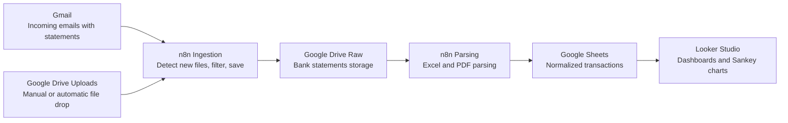

# FinFlow

FinFlow is a personal finance automation system using n8n, Google Sheets, and Looker Studio.  
It imports bank statements (Excel and later PDF), normalizes transactions, and builds visual dashboards including Sankey money flow charts.

## Architecture

